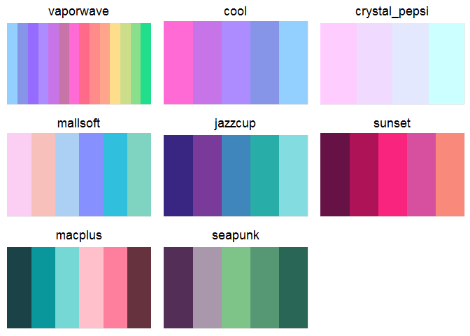
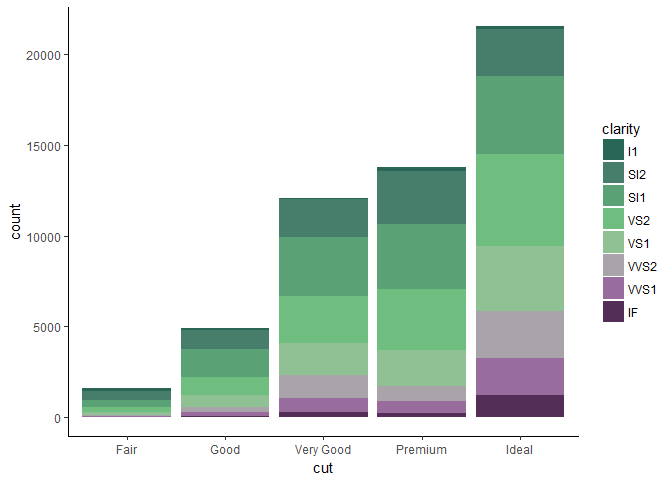
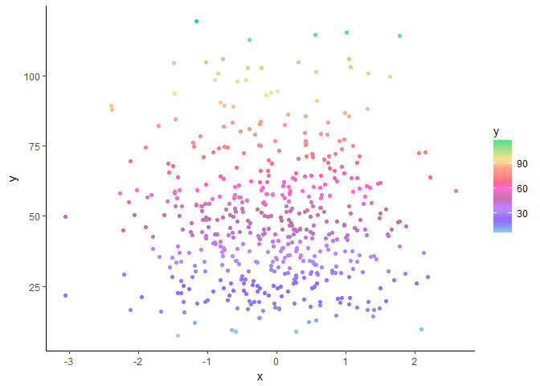

vapeplot
========


An R extension of the Python package [`vapeplot`](https://github.com/dantaki/vapeplot)'s color palettes. Design of this package drew on inspiration from `ggplot2::scale_*_viridis_c()` and `ggplot2::scale_*_viridis_d()`, and the [`nordic`](http://github.com/jkaupp/nord) package.


Available Palettes
------------------



Examples
--------

``` r
ggplot(diamonds) +
  geom_point(aes(x = carat, y = price, color = cut), alpha = 0.7) +
  scale_color_vapeplot_d("mallsoft") +
  theme_classic()
```


``` r
ggplot(diamonds) +
  geom_bar(aes(x = cut, fill = clarity)) +
  scale_fill_vapeplot_d("seapunk") +
  theme_classic()
```



``` r
df <- data.frame(x = rnorm(500),
                 y = rgamma(500, shape = 5, rate = 0.1))
ggplot(df) +
    geom_point(aes(x, y, color = y)) +
    scale_color_vapeplot_c() +
    theme_classic()
```


